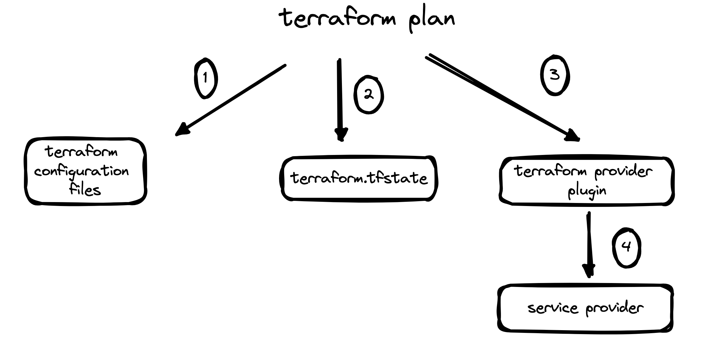
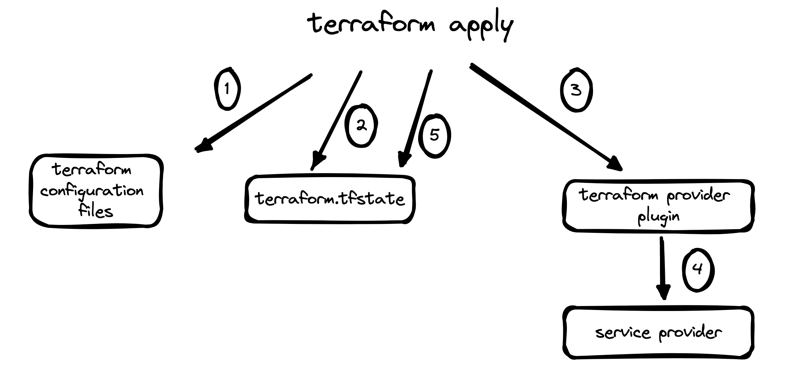

<div align="center">
    
    <br>
    <br>
</div>

# Learn the core concepts of terraform in depth with practice

In this tutorial, we'll delve into the process of provisioning and managing AWS EC2 instances using Terraform. Our primary goal is to gain insights into the inner workings of Terraform and its various functionalities. 

## Table of contents

- [Terraform providers](#terraform-providers)
- [Provider versions](#terraform-provider-versions)
- [Terraform plan](#terraform-plan)
- [Terraform apply](#deep-dive-into-terraform-apply)

## Terraform providers

Terraform providers are a key component of Terraform that enable it to interact with various cloud providers, services, and other APIs. These providers serve as plugins within Terraform and allow users to manage resources across different platforms using a consistent configuration language.

### Using Terraform Providers

To use a Terraform provider, you first need to declare it in your Terraform configuration file (main.tf). This declaration specifies which provider to use and any necessary authentication details.

For example, to use the AWS provider:
```
provider "aws" {
  region     = "us-west-2"
}
```

n this example, we specify the AWS provider and set the region. These values determine where and how Terraform will work with AWS.

Once the provider is declared, you can begin defining AWS resources in your Terraform configuration.


### Example: Provisioning an AWS EC2 Instance
Let's say we want to provision an EC2 instance on AWS using Terraform. We can achieve this by adding the following resource block to our configuration:

```
resource "aws_instance" "example" {
  ami           = "ami-0c55b159cbfafe1f0"  // This should be replaced with your desired AMI ID
  instance_type = "t2.micro"
}
```

In this example:
"aws_instance" is the resource type provided by the AWS provider.
"example" is a name given to this particular instance, which can be referenced elsewhere in the configuration.
"ami" specifies the Amazon Machine Image (AMI) to use for the instance.
"instance_type" defines the instance type, such as t2.micro, t2.small, etc.
When you run terraform apply, Terraform will create the specified EC2 instance in your AWS account based on the provided configuration.

### Conclusion
Terraform providers are powerful tools that enable infrastructure as code practitioners to manage resources across various cloud platforms and services. By understanding how to utilize providers and define resources, you can efficiently provision and manage your infrastructure using Terraform.


## Terraform provider versions
Providers evolve over time to introduce new features, enhancements, and bug fixes. Consequently, different versions of providers are released to accommodate these changes. Managing provider versions becomes critical to leverage new functionalities, ensure compatibility with the underlying infrastructure, and maintain security.

### Version Constraints
Use version constraints to specify acceptable provider versions within a certain range. This allows flexibility while ensuring compatibility with newer releases that meet your criteria. Avoid overly broad constraints to mitigate the risk of unintended upgrades that could introduce breaking changes.

### Practical Example

#### 1. Initializing Terraform:

In your terraform.tf file, set the version to version = "~> 3.0.0" and run terraform init. This creates a file named .terraform.lock.hcl in the working directory, capturing the provider configuration and dependencies.


#### 2. Observations:

- File `.terraform.lock.hcl` is created in the same working directory as main.tf. Content is as follow

```
provider "registry.terraform.io/hashicorp/aws" {
  version     = "3.0.0"
  constraints = "~> 3.0.0"
  hashes = [
    "h1:UyKRcHE2W3io32hVQD7s9Ovb9LSyTIvhAAPS9RX5vtg=",
    "zh:25294510ae9c250502f2e37ac32b01017439735f098f82a1728772427626a2fd",
    "zh:3b723e7772d47bd8cc11bea6e5d3e0b5e1df8398c0e7aaf510e3a8a54e0f1874",
    "zh:4b7b73b86f4a0705d5d2a7f1d3ad3279706bdb3957a48f4a389c36918fba838e",
    "zh:9e26cdc3be97e3001c253c0ca28c5c8ff2d5476373ca1beb849f3f3957ce7f1a",
    "zh:9e73cf1304bf57968d3048d70c0b766d41497430a2a9a7a718a196f3a385106a",
    "zh:a30b5b66facfbb2b02814e4cd33ca9899f9ade5bbf478f78c41d2fe789f0582a",
    "zh:b06fb5da094db41cb5e430c95c988b73f32695e9f90f25499e926842dbd21b21",
    "zh:c5a4ff607e9e9edee3fcd6d6666241fb532adf88ea1fe24f2aa1eb36845b3ca3",
    "zh:df568a69087831c1780fac4395630a2cfb3cdf67b7dffbfe16bd78c64770bb75",
    "zh:fce1b69dd673aace19508640b0b9b7eb1ef7e746d76cb846b49e7d52e0f5fb7e",
  ]
}
```

- Binary file downloaded: .terraform/providers/registry.terraform.io/hashicorp/aws/3.0.0/darwin_amd64, this is the provider plugin, which will help us to call aws api and provision our infrastructur defnied accordingly.


### Experimenting with Version Change:

Changing the AWS provider version in terraform.tf to 4.1.0 and rerunning terraform init results in an error, as the new version doesn't match the specified constraint. The version constraint file `.terraform.lock.hcl` will only be created the 1st time when do terraform init and it will be reused afterwords.

```
- Reusing previous version of hashicorp/aws from the dependency lock file
╷
│ Error: Failed to query available provider packages
│ 
│ Could not retrieve the list of available versions for provider hashicorp/aws: locked provider registry.terraform.io/hashicorp/aws
│ 3.0.0 does not match configured version constraint 4.1.0; must use terraform init -upgrade to allow selection of new versions
```

### Upgrading Provider:

To upgrade the AWS provider to version 4.1.0, run terraform init -upgrade. This updates the .terraform.lock.hcl file with the new version information.

Updated .terraform.lock.hcl:

```
provider "registry.terraform.io/hashicorp/aws" {
  version     = "4.1.0"
  constraints = "4.1.0"
  hashes = [
    # Updated hash values...
  ]
}
```

## Terraform plan 

### Introduction:

In the realm of infrastructure as code (IaC), Terraform stands out as a robust tool for provisioning and managing infrastructure resources. Among its arsenal of features, the terraform plan command holds a special place, offering users invaluable insights into the changes that will be applied to their infrastructure before actually executing them. In this blog post, we'll delve into the depths of Terraform's plan feature, uncovering its significance, functionality, and practical applications through real-world examples.

### Understanding Terraform Plan:
Terraform's plan feature provides a preview of the changes Terraform intends to make to your infrastructure. It meticulously analyzes your configuration files (written in HashiCorp Configuration Language or HCL) and current state to generate an execution plan. This plan outlines the additions, modifications, and deletions Terraform will enact when applied.

### The Anatomy of a Terraform Plan:
Before executing terraform plan, Terraform compares the current state of your infrastructure to the desired state defined in your configuration files. It then categorizes the impending changes into three primary actions:

`To Add`: Resources that will be created.
`To Change`: Resources that will be modified.
`To Destroy`: Resources that will be removed.


Let's dive into practical scenarios where Terraform's plan feature proves invaluable:

#### Example 1: Adding a New AWS EC2 Instance:
Suppose you're tasked with adding a new AWS EC2 instance to your infrastructure. Before executing any Terraform commands, run `terraform plan` to preview the changes:

```
  + resource "aws_instance" "app_server" {
      + ami                                  = "ami-0ce0c36d7a00b20e2"
      + arn                                  = (known after apply)
      + associate_public_ip_address          = (known after apply)
      + availability_zone                    = (known after apply)
      + cpu_core_count                       = (known after apply)
      + cpu_threads_per_core                 = (known after apply)
      + disable_api_termination              = (known after apply)
      + ebs_optimized                        = (known after apply)
      + get_password_data                    = false
      + host_id                              = (known after apply)
      + id                                   = (known after apply)
      + instance_initiated_shutdown_behavior = (known after apply)
      + instance_state                       = (known after apply)
      + instance_type                        = "t2.micro"
      + ipv6_address_count                   = (known after apply)
      + ipv6_addresses                       = (known after apply)
      + key_name                             = (known after apply)
      + monitoring                           = (known after apply)
      + outpost_arn                          = (known after apply)
      + password_data                        = (known after apply)
      + placement_group                      = (known after apply)
      + placement_partition_number           = (known after apply)
      + primary_network_interface_id         = (known after apply)
      + private_dns                          = (known after apply)
      + private_ip                           = (known after apply)
      + public_dns                           = (known after apply)
      + public_ip                            = (known after apply)
      + secondary_private_ips                = (known after apply)
      + security_groups                      = (known after apply)
      + source_dest_check                    = true
      + subnet_id                            = (known after apply)
      + tags                                 = {
          + "Name" = "test"
        }
      + tags_all                             = {
          + "Name" = "test"
        }
      + tenancy                              = (known after apply)
      + user_data                            = (known after apply)
      + user_data_base64                     = (known after apply)
      + vpc_security_group_ids               = (known after apply)
    }

Plan: 1 to add, 0 to change, 0 to destroy.
```

#### Example 2: Modifying EC2 tags:
Next, let's consider a scenario where you need to modify the tags of existing EC2 instace. After making the necessary changes to your Terraform configuration, execute terraform plan to review the proposed modifications:

```
  ~ resource "aws_instance" "app_server" {
        id                                   = "i-0baf381c58d1d8e06"
      ~ tags                                 = {
          ~ "Name" = "test1" -> "test2"
        }
      ~ tags_all                             = {
          ~ "Name" = "test1" -> "test2"
        }
    }

Plan: 0 to add, 1 to change, 0 to destroy.
```

#### Example 3: Removing Unused Resources:
In a cleanup scenario, you may want to remove unused resources from your infrastructure. By running terraform plan after updating your configuration to remove the resources, you can verify the planned deletions:

```bash
  # aws_instance.app_server will be destroyed
  # (because aws_instance.app_server is not in configuration)
  - resource "aws_instance" "app_server" {
      - ami                                  = "ami-0ce0c36d7a00b20e2" -> null
      - arn                                  = "arn:aws:ec2:us-east-1:222452998847:instance/i-0baf381c58d1d8e06" -> null
      - associate_public_ip_address          = true -> null
      - availability_zone                    = "us-east-1a" -> null
      - cpu_core_count                       = 1 -> null
      - cpu_threads_per_core                 = 1 -> null
      - disable_api_termination              = false -> null
      - ebs_optimized                        = false -> null
      - get_password_data                    = false -> null
      - hibernation                          = false -> null
      - id                                   = "i-0baf381c58d1d8e06" -> null
      - instance_initiated_shutdown_behavior = "stop" -> null
      - instance_state                       = "running" -> null
      - instance_type                        = "t2.micro" -> null
      - ipv6_address_count                   = 0 -> null
      - ipv6_addresses                       = [] -> null
      - monitoring                           = false -> null
      - primary_network_interface_id         = "eni-09c9bb3b19b922bd4" -> null
      - private_dns                          = "ip-172-31-22-55.ec2.internal" -> null
      - private_ip                           = "172.31.22.55" -> null
      - public_dns                           = "ec2-54-226-29-122.compute-1.amazonaws.com" -> null
      - public_ip                            = "54.226.29.122" -> null
      - secondary_private_ips                = [] -> null
      - security_groups                      = [
          - "default",
        ] -> null
      - source_dest_check                    = true -> null
      - subnet_id                            = "subnet-081cdd467e64c1a7c" -> null
      - tags                                 = {
          - "Name" = "test1"
        } -> null
      - tags_all                             = {
          - "Name" = "test1"
        } -> null
      - tenancy                              = "default" -> null
      - vpc_security_group_ids               = [
          - "sg-0bf7a30f5f5ae566e",
        ] -> null

      - capacity_reservation_specification {
          - capacity_reservation_preference = "open" -> null
        }

      - credit_specification {
          - cpu_credits = "standard" -> null
        }

      - enclave_options {
          - enabled = false -> null
        }

      - metadata_options {
          - http_endpoint               = "enabled" -> null
          - http_put_response_hop_limit = 1 -> null
          - http_tokens                 = "optional" -> null
          - instance_metadata_tags      = "disabled" -> null
        }

      - root_block_device {
          - delete_on_termination = true -> null
          - device_name           = "/dev/xvda" -> null
          - encrypted             = false -> null
          - iops                  = 0 -> null
          - tags                  = {} -> null
          - throughput            = 0 -> null
          - volume_id             = "vol-0b64b73621ef9e1c5" -> null
          - volume_size           = 8 -> null
          - volume_type           = "standard" -> null
        }
    }

Plan: 0 to add, 0 to change, 1 to destroy.
```

The plan output will list the resources slated for removal, allowing you to confirm the deletions and avoid unintentional data loss.


#### Example 4: Drift changes in AWS through AWS console
In a cleanup scenario, if you update the resource through manual action,l e.g. AWS console. By running terraform plan, you can see the terraform knows that there is change in tags of 
EC2 machine. This is interesting, how terraform knows that? Here is a diagram to show what terraform plan will do.

```bash
  # aws_instance.app_server will be updated in-place
  ~ resource "aws_instance" "app_server" {
        id                                   = "i-0baf381c58d1d8e06"
      ~ tags                                 = {
          ~ "Name" = "test1" -> "test"
        }
      ~ tags_all                             = {
          ~ "Name" = "test1" -> "test"
        }
    }

Plan: 0 to add, 1 to change, 0 to destroy.
```

<div align="center">
    
    <br>
    <br>
</div>

Terraform will refer to the configuration file, the state file and then find the managed resource in AWS through AWS provider plugin. The state file will help terraform to trace which resource in managed by terraform and you should not delete the state file. Terraform plan just refer to the tfstate file but it won't update it.


### Conclusion:
Terraform's plan feature empowers infrastructure engineers with foresight and control over their infrastructure deployments. By leveraging the insights provided by terraform plan, teams can mitigate risks, enhance collaboration, and maintain compliance in their infrastructure management endeavors. Embrace the power of Terraform planning, and embark on a journey towards more predictable and resilient infrastructure deployments.


## Deep Dive into Terraform Apply

### Introduction:
Terraform is a powerful infrastructure as code tool that allows you to define and manage your infrastructure using a declarative configuration language. One of the key commands in Terraform is apply, which is used to apply the changes specified in your Terraform configuration to your infrastructure. In this blog post, we'll take a deep dive into the terraform apply command, exploring its features, options, and best practices with practical examples.

### Understanding Terraform Apply:
The terraform apply command is used to apply the changes described in your Terraform configuration to your infrastructure. When you run terraform apply, Terraform reads the configuration files (usually written in HashiCorp Configuration Language or HCL) in your current directory and creates, updates, or deletes resources as necessary to match the desired state defined in those files.

### Key Features and Options:

`State Management`: Terraform maintains a state file (terraform.tfstate) that keeps track of the current state of your infrastructure. The terraform apply command updates this state file to reflect the changes made to your infrastructure.

`Execution Plan`: Before making any changes, Terraform generates an execution plan, which shows you what actions it will take to apply your configuration. You can review this plan before confirming the changes with terraform apply.

`Refresh Only` When executing terraform apply -refresh-only, Terraform diligently examines the existing state of your infrastructure without applying any changes specified in your configuration files. Instead, its primary function is to refresh the Terraform state based on the current state of the real-world infrastructure.

### Practical Examples:
Let's walk through some practical examples to illustrate the usage of terraform apply:

#### Example 1: Provisioning AWS EC2 Instance

```
# Define an AWS EC2 instance resource named "app_server"
resource "aws_instance" "app_server" {
  # Use the latest Amazon Linux AMI as the image for the instance
  ami           = data.aws_ami.amazon_linux.id
  # Use a t2.micro instance type
  instance_type = "t2.micro"

  # Add tags to the instance for easier identification
  tags = {
    Name = "test"
  }
}

# Retrieve information about the latest Amazon Linux AMI
data "aws_ami" "amazon_linux" {
  # Specify that the owner of the AMI should be "amazon"
  owners      = ["amazon"]
  # Specify that we want the most recent AMI
  most_recent = true

  # Define filters to narrow down the search for the AMI
  filter {
    # Filter by the name of the AMI
    name   = "name"
    # Specify the pattern for the name of the AMI
    values = ["amzn2-ami-hvm-*-x86_64-ebs"]
  }
}

```

To apply this configuration, navigate to the directory containing main.tf and run:

```
terraform init
terraform plan
terraform apply
```


After execute `terraform plan`, we can see the following output in the terminal. Terraform plan will retrive the architecture in real world and compare with the state in `terraform.tfstate` file and generate output.

```
symbols:
  + create

Terraform will perform the following actions:

  # aws_instance.app_server will be created
  + resource "aws_instance" "app_server" {
      + ami                                  = "ami-0ce0c36d7a00b20e2"
      + arn                                  = (known after apply)
      + associate_public_ip_address          = (known after apply)
      + availability_zone                    = (known after apply)
      + cpu_core_count                       = (known after apply)
      + cpu_threads_per_core                 = (known after apply)
      + disable_api_termination              = (known after apply)
      + ebs_optimized                        = (known after apply)
      + get_password_data                    = false
      + host_id                              = (known after apply)
      + id                                   = (known after apply)
      + instance_initiated_shutdown_behavior = (known after apply)
      + instance_state                       = (known after apply)
      + instance_type                        = "t2.micro"
      + ipv6_address_count                   = (known after apply)
      + ipv6_addresses                       = (known after apply)
      + key_name                             = (known after apply)
      + monitoring                           = (known after apply)
      + outpost_arn                          = (known after apply)
      + password_data                        = (known after apply)
      + placement_group                      = (known after apply)
      + placement_partition_number           = (known after apply)
      + primary_network_interface_id         = (known after apply)
      + private_dns                          = (known after apply)
      + private_ip                           = (known after apply)
      + public_dns                           = (known after apply)
      + public_ip                            = (known after apply)
      + secondary_private_ips                = (known after apply)
      + security_groups                      = (known after apply)
      + source_dest_check                    = true
      + subnet_id                            = (known after apply)
      + tags                                 = {
          + "Name" = "test"
        }
      + tags_all                             = {
          + "Name" = "test"
        }
      + tenancy                              = (known after apply)
      + user_data                            = (known after apply)
      + user_data_base64                     = (known after apply)
      + vpc_security_group_ids               = (known after apply)
    }

Plan: 1 to add, 0 to change, 0 to destroy.
```


We enter yes, once finished, we can see that one file `terraform.tfstate` is created. This is so important as this is core file that terraform relys on to do other jobs. Let's explore it.

```json
{
  "version": 4,
  "terraform_version": "1.7.4",
  "serial": 1,
  "lineage": "22b9c12b-007d-02e5-5f01-c68abf1e6444",
  "outputs": {},
  "resources": [
    {
      "mode": "data",
      "type": "aws_ami",
      "name": "amazon_linux",
      "provider": "provider[\"registry.terraform.io/hashicorp/aws\"]",
      "instances": [
        {
          "schema_version": 0,
          "attributes": {
            "architecture": "x86_64",
            "arn": "arn:aws:ec2:us-east-1::image/ami-0ce0c36d7a00b20e2",
            "block_device_mappings": [
              {
                "device_name": "/dev/xvda",
                "ebs": {
                  "delete_on_termination": "true",
                  "encrypted": "false",
                  "iops": "0",
                  "snapshot_id": "snap-0786fd4c26c83f317",
                  "throughput": "0",
                  "volume_size": "8",
                  "volume_type": "standard"
                },
                "no_device": "",
                "virtual_name": ""
              }
            ],
            "boot_mode": "",
            "creation_date": "2024-03-07T20:03:28.000Z",
            "description": "Amazon Linux 2 AMI 2.0.20240306.2 x86_64 HVM ebs",
            "ena_support": true,
            "executable_users": null,
            "filter": [
              {
                "name": "name",
                "values": [
                  "amzn2-ami-hvm-*-x86_64-ebs"
                ]
              }
            ],
            "hypervisor": "xen",
            "id": "ami-0ce0c36d7a00b20e2",
            "image_id": "ami-0ce0c36d7a00b20e2",
            "image_location": "amazon/amzn2-ami-hvm-2.0.20240306.2-x86_64-ebs",
            "image_owner_alias": "amazon",
            "image_type": "machine",
            "kernel_id": null,
            "most_recent": true,
            "name": "amzn2-ami-hvm-2.0.20240306.2-x86_64-ebs",
            "name_regex": null,
            "owner_id": "137112412989",
            "owners": [
              "amazon"
            ],
            "platform": null,
            "platform_details": "Linux/UNIX",
            "product_codes": [],
            "public": true,
            "ramdisk_id": null,
            "root_device_name": "/dev/xvda",
            "root_device_type": "ebs",
            "root_snapshot_id": "snap-0786fd4c26c83f317",
            "sriov_net_support": "simple",
            "state": "available",
            "state_reason": {
              "code": "UNSET",
              "message": "UNSET"
            },
            "tags": {},
            "usage_operation": "RunInstances",
            "virtualization_type": "hvm"
          },
          "sensitive_attributes": []
        }
      ]
    },
    {
      "mode": "managed",
      "type": "aws_instance",
      "name": "app_server",
      "provider": "provider[\"registry.terraform.io/hashicorp/aws\"]",
      "instances": [
        {
          "schema_version": 1,
          "attributes": {
            "ami": "ami-0ce0c36d7a00b20e2",
            "arn": "arn:aws:ec2:us-east-1:058568287484:instance/i-0a16920a836e8578e",
            "associate_public_ip_address": true,
            "availability_zone": "us-east-1a",
            "capacity_reservation_specification": [
              {
                "capacity_reservation_preference": "open",
                "capacity_reservation_target": []
              }
            ],
            "cpu_core_count": 1,
            "cpu_threads_per_core": 1,
            "credit_specification": [
              {
                "cpu_credits": "standard"
              }
            ],
            "disable_api_termination": false,
            "ebs_block_device": [],
            "ebs_optimized": false,
            "enclave_options": [
              {
                "enabled": false
              }
            ],
            "ephemeral_block_device": [],
            "get_password_data": false,
            "hibernation": false,
            "host_id": null,
            "iam_instance_profile": "",
            "id": "i-0a16920a836e8578e",
            "instance_initiated_shutdown_behavior": "stop",
            "instance_state": "running",
            "instance_type": "t2.micro",
            "ipv6_address_count": 0,
            "ipv6_addresses": [],
            "key_name": "",
            "launch_template": [],
            "metadata_options": [
              {
                "http_endpoint": "enabled",
                "http_put_response_hop_limit": 1,
                "http_tokens": "optional",
                "instance_metadata_tags": "disabled"
              }
            ],
            "monitoring": false,
            "network_interface": [],
            "outpost_arn": "",
            "password_data": "",
            "placement_group": "",
            "placement_partition_number": null,
            "primary_network_interface_id": "eni-0c0513d295133211d",
            "private_dns": "ip-172-31-22-16.ec2.internal",
            "private_ip": "172.31.22.16",
            "public_dns": "ec2-54-197-200-84.compute-1.amazonaws.com",
            "public_ip": "54.197.200.84",
            "root_block_device": [
              {
                "delete_on_termination": true,
                "device_name": "/dev/xvda",
                "encrypted": false,
                "iops": 0,
                "kms_key_id": "",
                "tags": {},
                "throughput": 0,
                "volume_id": "vol-0b4e7ce0f86ec2fa5",
                "volume_size": 8,
                "volume_type": "standard"
              }
            ],
            "secondary_private_ips": [],
            "security_groups": [
              "default"
            ],
            "source_dest_check": true,
            "subnet_id": "subnet-0efeb4bc1fa4cda6e",
            "tags": {
              "Name": "test"
            },
            "tags_all": {
              "Name": "test"
            },
            "tenancy": "default",
            "timeouts": null,
            "user_data": null,
            "user_data_base64": null,
            "volume_tags": null,
            "vpc_security_group_ids": [
              "sg-0f192dbb8c60efc48"
            ]
          },
          "sensitive_attributes": [],
          "private": "eyJlMmJmYjczMC1lY2FhLTExZTYtOGY4OC0zNDM2M2JjN2M0YzAiOnsiY3JlYXRlIjo2MDAwMDAwMDAwMDAsImRlbGV0ZSI6MTIwMDAwMDAwMDAwMCwidXBkYXRlIjo2MDAwMDAwMDAwMDB9LCJzY2hlbWFfdmVyc2lvbiI6IjEifQ==",
          "dependencies": [
            "data.aws_ami.amazon_linux"
          ]
        }
      ]
    }
  ],
  "check_results": null
}

```


#### Example 2: terraform apply if no changes


Running terraform apply again after no modifications will result in no changes being applied. Terraform intelligently identifies that the desired state articulated in the tfstate file aligns with the current state of the infrastructure.

#### Example 3: delete the resource in terrafrom.tfstate file


If we delete the `aws_instance` resource in tfstate file and run `terraform apply` again, then it shows that terraform will re-create the ec2 instance. There is one EC2 instance still exists in AWS but as the tfstate file has been deleted, so terraform is nor aware that that EC2 instance in in 'managed' state, and hence it will ceeate a new one.

Here is the diagram of how terraform apply command works and which resource it will refer to.

<div align="center">
    
    <br>
    <br>
</div>

If a resource is deleted from the tfstate file and terraform apply is executed, Terraform will recognize the absence of the resource and proceed to recreate it to ensure alignment with the desired state.


#### Example 4: drift detecting with terraform refresh only


By modifying a resource's attributes outside of Terraform and subsequently running terraform apply -refresh-only, Terraform detects the discrepancies and presents the changes it would apply. This allows for synchronization of the Terraform state with the real-world infrastructure without altering any actual resources. 

Let's modify the EC2's tag through AWS console, and run `terraform apply -refresh-only` again, then it detected cahnges:

```
Terraform detected the following changes made outside of Terraform since the last "terraform apply" which may have affected this plan:

  # aws_instance.app_server has changed
  ~ resource "aws_instance" "app_server" {
        id                                   = "i-0a16920a836e8578e"
      ~ tags                                 = {
          ~ "Name" = "test" -> "test1"
        }
      ~ tags_all                             = {
          ~ "Name" = "test" -> "test1"
        }
        # (27 unchanged attributes hidden)

        # (5 unchanged blocks hidden)
    }


This is a refresh-only plan, so Terraform will not take any actions to undo these. If you were expecting these changes then you can
apply this plan to record the updated values in the Terraform state without changing any remote objects.

Would you like to update the Terraform state to reflect these detected changes?
  Terraform will write these changes to the state without modifying any real infrastructure.
  There is no undo. Only 'yes' will be accepted to confirm.
```

If we enter 'yes', the tfstate file will be updated. 

This is equivant to `terraform refresh`, which retrieve the real world's infra state and will update tfstate file.


We can infer that when run `terraform apply` or `terraform plan`, terraform reads the state file to understand the current state of your infrastructure. This file contains a mapping between the resources managed by Terraform and their corresponding identifiers and attributes in the real-world infrastructure.

While the state file is the primary source of truth for the current state, Terraform may also interact with provider plugins to gather additional information about the resources. This interaction can help validate the current state of resources, especially for complex resources or cases where the state file might be outdated or inconsistent.

### Conclusion:
Through this guide, we've explored the intricacies of the terraform apply command, showcasing its significance in managing infrastructure as code effectively. By leveraging its features and options alongside practical examples, you're empowered to streamline infrastructure management workflows with Terraform. Whether provisioning, updating, or auditing infrastructure, Terraform's apply command serves as a cornerstone for achieving infrastructure automation and consistency.


## terraform destroy

```
terraform destroy
```

## remove terraform files
```
rm -rf .terraform*
rm -rf terraform.tfstate*
```